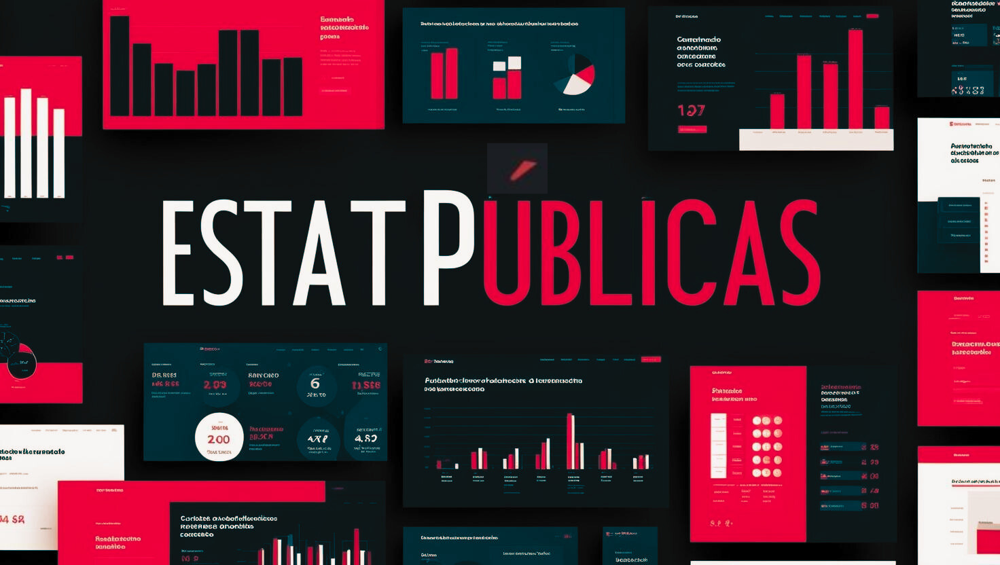

  

## Sobre { .h2-center }

O **EstatPúblicas** é um Grupo de Pesquisa em Estatísticas Públicas criado com o intuito de congregar pesquisadores que trabalham com produção de estatísticas e discussão de métodos de coleta, limpeza, qualidade, cálculo e disseminação de dados e informações.

---

## Missão { .h2-center }

  <blockquote>
    "Nossa missão é desenvolver conhecimento e ferramentas estatísticas que auxiliem na resolução de desafios públicos complexos, apoiando governos, organizações e a sociedade civil no uso eficaz de dados para promover bem-estar social e equidade."
  </blockquote>

---

## Linhas de pesquisa { .h2-center }
<section class="research-section">
  <ul>
    <li>📑 <b>Métodos e qualidade de dados:</b> estudos de metodologia de cálculo, discussões sobre fontes de dados, procedimentos de revisão, crítica e validação e imputação de dados. </li>
    <li>📈 <b>Indicadores e Índices compostos:</b> cálculos de indicadores nas temáticas demográficas, econômicas, sociais, ambientais e transversais e aos estudos da análise desses indicadores. Além disso, incorpora as pesquisas que envolvem os estudos de índices como o Índice de Desenvolvimento Humano Municipal e suas variações e o Índice Mineiro de Responsabilidade Social. </li>
    <li>🤖 <b>Transformação digital:</b> estudos e aplicações da transformação digital em diferentes etapas da produção da estatística desde a extração de dados, rotinas de processamento até a produção de produtos de disseminação como plataformas de dados. </li>
  </ul>
</section>

---

## Princípios fundamentais { .h2-center }
  
Assista ao vídeo para entender os princípios fundamentais das estatísticas oficiais.

  

  <iframe width="100%" height="400" src="https://www.youtube.com/embed/doqQtGv7nDM?si=DV1F1YNMOlILaeCU" title="YouTube video player" frameborder="0" allow="accelerometer; autoplay; clipboard-write; encrypted-media; gyroscope; picture-in-picture; web-share" referrerpolicy="strict-origin-when-cross-origin" allowfullscreen></iframe>

---

## Contato { .h2-center }
  
Líderes do grupo:

<section class="contact-section">
  

    <b>Caio César Soares Gonçalves </b>  
    <i>caio.goncalves@fjp.mg.gov.br</i>  
  

  

    <b>Renato Vale Santos </b>  
    <i>renato.vale@fjp.mg.gov.br</i>  
  

</section>

  
© 2025 EstatPúblicas. Todos os direitos reservados.

